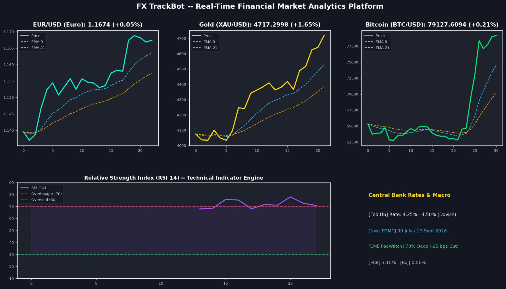
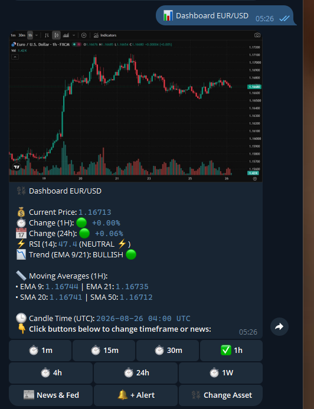

# 📊 FX TrackBot — Real-Time Forex, Metals & Crypto Telegram Analytics Platform



<p center>
  
</p>

[](https://www.python.org/)
[](https://docs.aiogram.dev/)
[](https://playwright.dev/)
[](https://www.tradingview.com/)
[](https://www.docker.com/)
[](LICENSE)

An asynchronous financial market intelligence Telegram Bot built with **Python 3.11**, **aiogram 3**, **Playwright Chromium**, and **yfinance**. It delivers authentic real-time **TradingView candlestick charts**, technical indicators (**RSI, EMA 9/21, SMA 20/50**), **custom price alerts**, **macroeconomic central bank interest rates (Fed / ECB / BoJ)**, and live financial news.

---

## 🌟 Key Features & Architecture Highlights

### 🔴 1. Live TradingView Real-Time Chart Rendering
- **Playwright Chromium Headless Renderer:** Takes real-time snapshots of authentic TradingView interactive candlestick widgets.
- **4 Selectable Visual Chart Themes:**
  1. `🔴 Live TradingView Real-Time` — Authentic TradingView widget snapshot.
  2. `📺 TradingView Dark (Fast)` — High-speed dark mode chart.
  3. `⚡ Cyber Technical` — High-contrast neon cyberpunk theme with trend fill.
  4. `🎨 Smooth Gradient` — Ultra-sleek spline-interpolated price curve with area gradient.

### 🌐 2. Multi-Asset & Multi-Market Coverage
- **Forex Pairs:** `EUR/USD`, `GBP/USD`, `USD/JPY`, `AUD/USD`, `USD/CAD`, `USD/CHF`, `NZD/USD`, `EUR/GBP`, `EUR/JPY`, `GBP/JPY`.
- **Precious Metals & Commodities:** 🥇 Gold (`XAU/USD`), 🥈 Silver (`XAG/USD`), 🛢️ Oil (`WTI`).
- **Cryptocurrencies:** 🪙 Bitcoin (`BTC`), 💎 Ethereum (`ETH`), ☀️ Solana (`SOL`), 💎 TON, 🚀 XRP, 🐕 DOGE.
- **Dynamic Ticker Search:** Search any global stock ticker (`NVDA`, `AAPL`, `TSLA`) directly in chat.

### 🔔 3. 24/7 Background Price Alert Engine
- **Asynchronous Task Scheduler:** Background loop polls market prices every 60 seconds without blocking Telegram responsiveness.
- **Smart Condition Detection:** Triggers instant notifications when prices cross target thresholds (`ABOVE` 📈 or `BELOW` 📉).

### 📰 4. Central Bank Rates & Financial Market News
- **🏛 Central Bank Interest Rates Tracker:** Real-time rates & monetary policy bias for **Fed (ФРС США)**, **ECB (ЕЦБ)**, **BoE**, **BoJ**, and **SNB**.
- **📅 FOMC Meeting Dates & Expectations:** Displays exact dates of upcoming Fed rate decisions and **CME FedWatch** market probability metrics (e.g. `78% -25 bps cut`).
- **📰 Live Financial News Feed:** Real-time headlines, publishers, and publication timestamps with direct article links.

### 🌍 5. Multi-Language Support & Disk Persistence
- Full localization in **English (🇬🇧)**, **Russian (🇷🇺)**, and **Ukrainian (🇺🇦)** backed by JSON persistence.

---

## 🛠 Tech Stack

- **Language & Runtime:** Python 3.11+
- **Bot Framework:** `aiogram 3.x` (Async Telegram Bot API framework)
- **Browser Automation:** `Playwright` (Headless Chromium)
- **Market Data Engine:** `yfinance`, `pandas`, `numpy`, `scipy`
- **Visualization:** `matplotlib`, `Pillow (PIL)`
- **Containerization:** Docker & Docker Compose

---

## 📁 Repository Structure

```text
forexbot/
├── bot.py                     # Entry point & 24/7 alert polling loop
├── config.py                  # Environment config & symbol aliases
├── alerts.py                  # In-memory price alert engine
├── locales.py                 # Multi-language localization & JSON persistence
├── Dockerfile                 # Production Docker container setup
├── requirements.txt           # Python dependencies
├── assets/
│   ├── banner.jpg                     # High-resolution project header banner
│   └── telegram_dashboard_preview.png # Live Telegram UI screenshot
├── handlers/
│   └── bot_handlers.py        # Telegram command & callback query router
└── services/
    ├── forex_service.py       # Data fetcher, RSI & Moving Averages calculator
    ├── chart_service.py       # Playwright TV renderer & Matplotlib themes
    ├── smc_service.py         # Smart Money Concepts calculation module
    └── news_service.py        # Live financial news parser & Fed rates engine
```

---

## 🚀 Quick Start (Local Setup)

### 1. Clone the Repository
```bash
git clone https://github.com/YOUR_GITHUB_USERNAME/forex-analytics-bot.git
cd forex-analytics-bot
```

### 2. Create & Activate Virtual Environment
```bash
python -m venv venv
# On Windows:
.\venv\Scripts\activate
# On Linux / macOS:
source venv/bin/activate
```

### 3. Install Dependencies & Playwright Browser
```bash
pip install -r requirements.txt
playwright install chromium
```

### 4. Configure Environment Variables
Copy `.env.example` to `.env` and set your Telegram Bot Token:
```env
TELEGRAM_BOT_TOKEN=your_bot_token_from_botfather
CHECK_INTERVAL_MINUTES=15
DEFAULT_PAIRS=EURUSD=X,GBPUSD=X,USDJPY=X,GC=F,BTC-USD,ETH-USD
```

### 5. Launch the Bot
```bash
python bot.py
```

---

## 🐳 Docker Deployment

```bash
# Build image
docker build -t fx-trackbot .

# Run container
docker run -d --name fx-trackbot-instance --env-file .env fx-trackbot
```

---

## 📌 Telegram Commands & Navigation

| Command / Button | Description |
| :--- | :--- |
| `/start` | Launches interactive bot menu |
| `📊 Dashboard` | Detailed asset analysis + Live TradingView chart |
| `⏱ Timeframes` | Switch timeframes (`1m`, `15m`, `30m`, `1h`, `4h`, `24h`, `1W`) |
| `📰 News & Fed` | Real-time market headlines & FOMC rate expectations |
| `🔔 Price Alerts` | Add, manage & clear price notifications |
| `⚙️ Settings` | Switch language (RU/EN/UK) or visual chart style |

---

## 🔒 Security Best Practices
- **Credential Isolation:** Secrets stored exclusively in `.env` (ignored by `.git`).
- **Sanitized Inputs:** All ticker inputs normalized before executing API calls.

---

## 📄 License
This project is open-source under the [MIT License](LICENSE).
